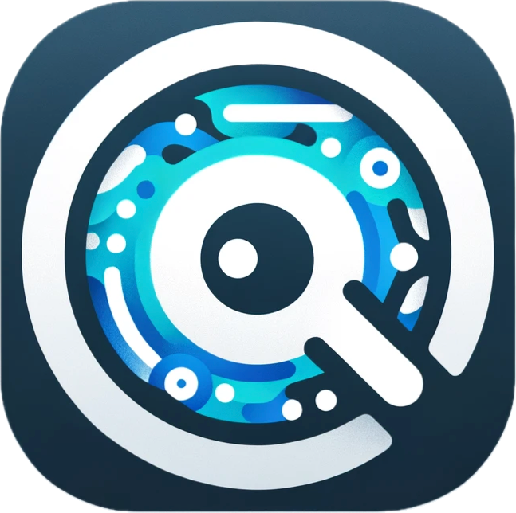

# agent4you

**Bring Your Own Agent right into your browser!**

## Overview

agent4you is a powerful Chrome extension that brings AI assistance directly into your browsing experience. Simply highlight text on any webpage, right-click, and send it to OpenAI's powerful language models for instant assistance, analysis, or transformation.

## Features

- 🔍 **Context Menu Integration**: Highlight any text on a webpage and access AI assistance directly through your browser's context menu
- 📝 **Custom Prompt Templates**: Create and save your own prompt templates for specific tasks
- 🔄 **Multi-step Workflows**: Build sequential AI processing workflows that pass content through multiple prompts
- 🔑 **Flexible API Key Management**: Use a global API key or set specific keys for individual templates
- 📱 **Elegant UI**: Beautiful, draggable response interface with Markdown support
- 🔄 **Continued Conversations**: Follow up with additional queries in the same conversation

## Installation

### From Chrome Web Store
*(Coming Soon)*

### Manual Installation
1. Download or clone this repository
2. Open Chrome and navigate to `chrome://extensions/`
3. Enable "Developer mode" (toggle in the top-right corner)
4. Click "Load unpacked" and select the extension directory
5. The extension should now be installed and ready to use

## Setup

1. Click on the extension icon or right-click anywhere and select "Options..." from the context menu
2. Enter your OpenAI API key in the "Global API Key" section
3. Create custom prompt templates as needed

## Usage

### Basic Usage
1. Highlight any text on a webpage
2. Right-click to open the context menu
3. Select "Ask OpenAI" to send the selected text to OpenAI with a default prompt
4. View the response in a clean, draggable interface

### Custom Templates
1. Set up custom templates in the Options page
2. Highlight text on any webpage
3. Right-click and select your custom template from the context menu
4. The extension will process your request according to your template settings

### Creating Workflows
1. In the Options page, create a new template
2. Enable "Workflow Steps"
3. Add multiple processing steps that build upon each other
4. Use `{selection}` to reference the original selected text
5. Use `{previousOutput}` to reference the output from the previous step

## Configuration Options

### Global Settings
- **API Key**: Your default OpenAI API key for all templates

### Template Settings
- **Title**: The name that appears in the context menu
- **Prompt Content**: The prompt sent to OpenAI (use `{selection}` as a placeholder for selected text)
- **OpenAI Model**: Choose which model to use (gpt-3.5-turbo, gpt-4, etc.)
- **Specific API Key**: Optional API key for this specific template
- **Workflow Steps**: Sequential processing steps for complex tasks

## Contributing

Contributions are welcome! Please feel free to submit a Pull Request.

## License

This project is licensed under the Non-Commercial Software License (NCOSL) 1.0. See the [LICENSE](LICENSE) file for details.

For any commercial use of the Software, please contact the copyright holder for a separate commercial license.

## Acknowledgments

- Uses the [marked.js](https://github.com/markedjs/marked) library for Markdown rendering

---

Created with ❤️ by Zhiyuan Ma 